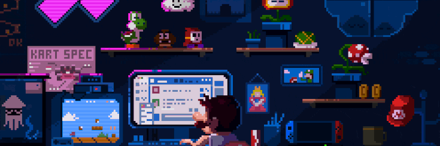
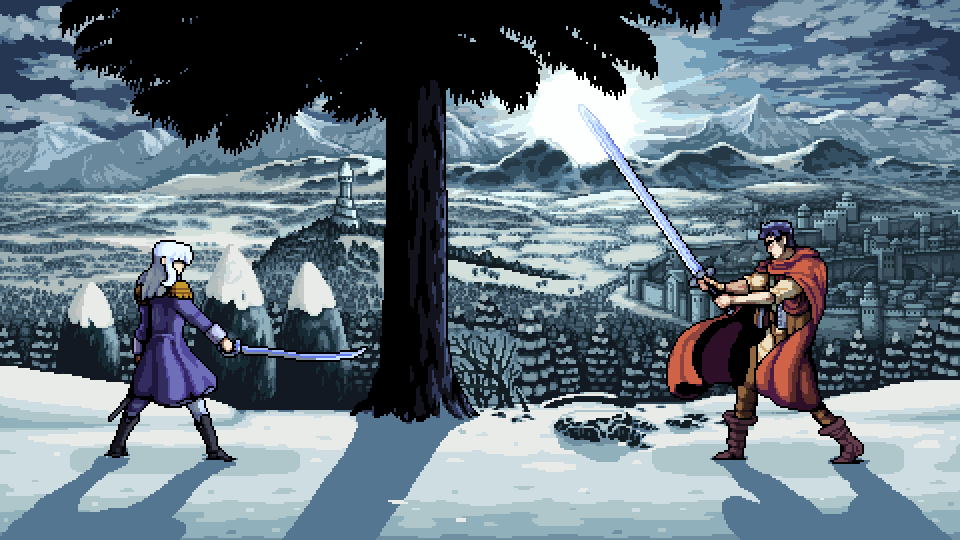

  

 

  

---

  <h3>👤 About Me</h3>
  

    🎓 <b>Systems Engineering</b> student at Universidad de Antioquia. 
    💻 <b>Full-Stack Developer</b> working mainly in the JavaScript ecosystem. 
    📊 Exploring <b>Data Science</b> on the side — Python, stats & beyond. 
    🏋️ Gym rat. ⚽ Real Madrid supporter. 🎮 Gamer at heart. 
    🌱 Currently deepening my skills in <b>React</b>, <b>Node.js</b> and <b>Algorithms</b>.
  

---

  <h3>🛠️ Tech Stack</h3>

  **Frontend** 
  
  
  
  
  
  

  **Backend & Tools** 
  
  
  
  

---

  <h3>📊 GitHub Stats</h3>

  
   
  
  

  

  

